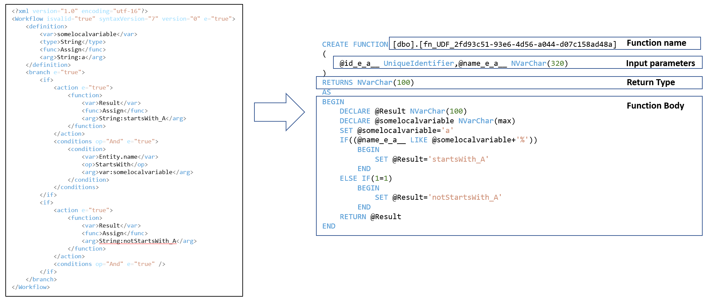

[Home](../README.md)
# Computed Columns in SQL Server
## Problem
Dynamics and Salesforce offers feature of Calculated/Computed/Rollup fields. Value of the field is calculated, based on other field' s values, in the context of rollup fields - values of different records.
Firstly, it is neccesary to investigate existing solution of Dynamics and Salesforce.
Based on their implementation, design and develope our implementation.
Idea is, that user will define caluclated fields as rule/workflow.

## Soulution
* Result of investigation-Dynamics uses sql scripts (UDF-User Defined Function) and these columns are in sql server defined as computed columns, so their values are recalculate during query.
* The core of the whole implementation is translation process of defined formula (XML Workflow) to UDF.
* On the image below, you can see more information about translation.

* Actually supported functions: TBD
* Based on our company strategy, this project was stopped, so rollup fields were not implemented. 

[->Next: Data Model Explorer](../dataModelExplorer/readme.md)