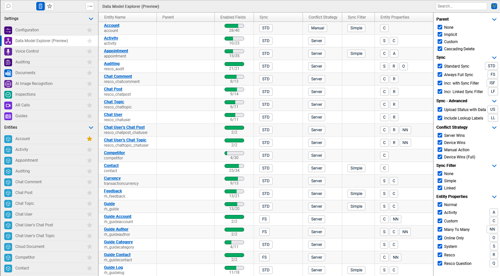

[Home](../README.md)
# Data Model Explorer

[Doc - Data Model Explorer](https://docs.resco.net/wiki/Data_model_explorer)

[Video  (20s-30s)](https://www.youtube.com/watch?v=19QP068_dHoy)

## Tech Stack
#typescript #knockoutjs

## Problem
User is not able see global overview of mobile project customization, especially settings of entities. It is hard and time-consuming to identify problems of the customization. The goal is to have tool which will provide overview of used entities. In addition, it would be nice to provide graphical visualization of relations between entities.

## Solution
Data Model Explorer offers overview of the entities used in your app project. At a glance, you can identify large tables with many columns and review their conflict resolution or synchronization strategies.

* In Progess - visualization of relations between entities

[->Next: ALIS](../alis/readme.md)