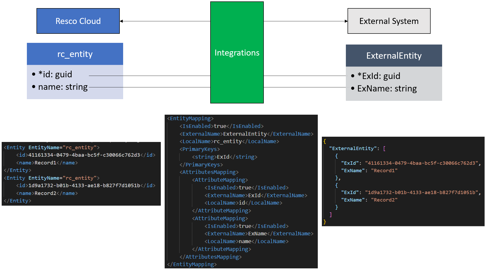
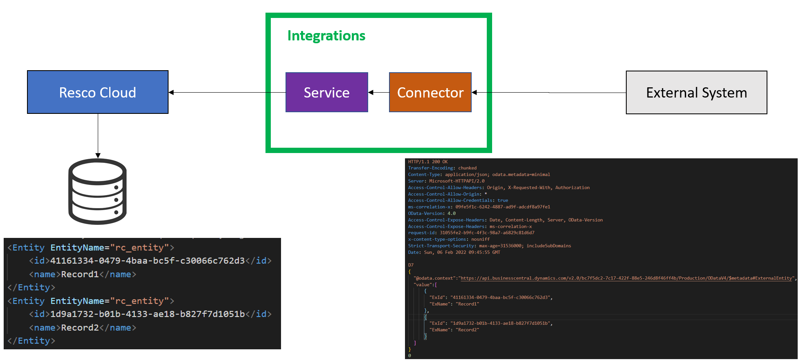
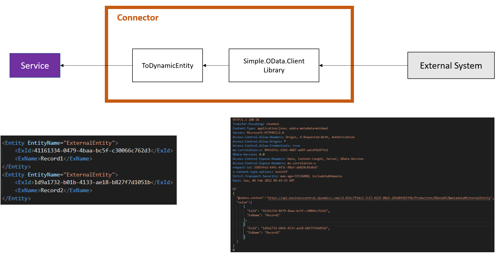
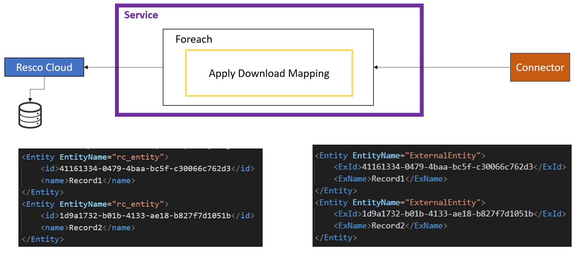
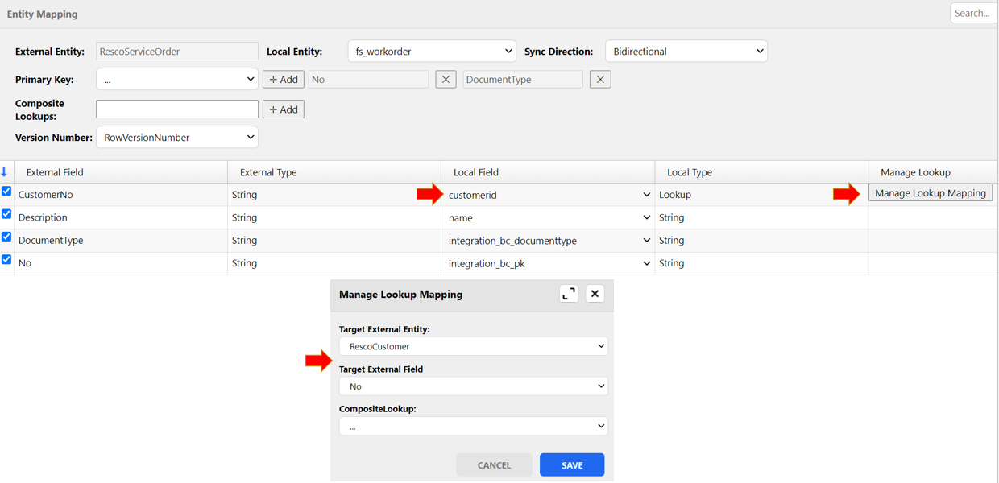
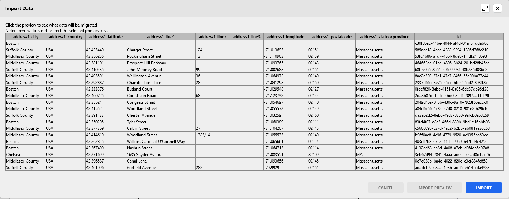

[Home](../README.md)
# Integrations with 3rd party system
https://www.youtube.com/watch?v=dJET31E0l0E&t=2189s

https://www.youtube.com/watch?v=trD-VEk360Q&t=1678s

Official documentation:

https://docs.resco.net/wiki/Integrations

https://docs.resco.net/wiki/Business_Central

## Problem
A lot of customers run their solutions on the 3rd party system and want to sync data to/from their system.
Generic integration tool, with possibility to define mapping between these two systems would be very beneficial.
The integration tool shoud offer different connectors.
In addition, synchronization between environments should be schedulable and communication between environments must be secure.

At the end of this task, user should be able to integrate Business Central and Dynamics environemts with Resco Server.

## Soulution
The integration tool was implemented for these three entities:
1. Resco Server
2. Web application for setup connection, mapping and configuration
3. 3rd party system

### 1.Resco server contains two main parts:
a) Core Service
- server for web application
- storing mapping, configuration
- retrieving data from database, transform data, based on mapping and configuration, sending data to connectors to send it to the 3rd party system
- receiving data from connectors, transform data based on mapping and configuration and saving it to the database  

b) Connectors
- 3 different connectors were implemented (Resco, OData, Tripin-public avalilable odata server)
- Simple.OData.Client library was used in OData connector
- OAuth2.0 device code flow was implemented

### 2.Web application
- editor for managing different connection was created
- device code flow was used for authentication, so credentials was securely stored in Resco Server
- editor for setup mapping and configuration was created
- user was able to define filters
- user was even ale to see preview of export/import
- editor was able to detect deleted entities or fields

### 3. 3rd party system
- very important part of the creating solution was to study documentation about the system
- for business central it was necessary to create some extensions which will allow to read versionnumber of the tables
- you can see code of these extensions on the page: [BC Extensions](https://github.com/Resconet/RescoIntegrations)

Based on our company strategy, this project was stopped, so anther connectors were not implemented. 
From my point of view it was very, very interesting project.

[->Next: Blob storage connectors](../blobStorage/readme.md)