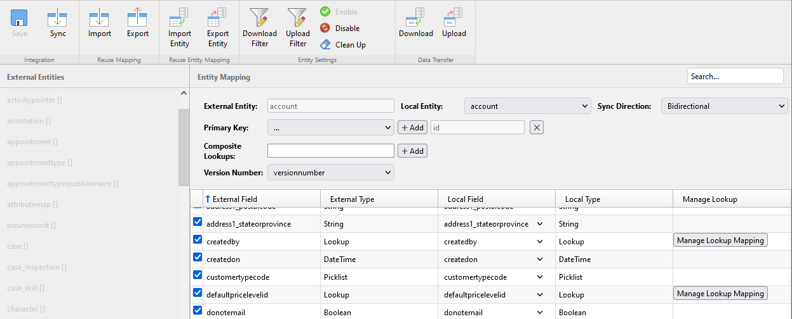

[Home](../README.md)
# Integrations with 3rd party system

[Webinar 1](https://www.youtube.com/watch?v=dJET31E0l0E&t=2189s)

[Webinar 2](https://www.youtube.com/watch?v=trD-VEk360Q&t=1678s)

[Doc - Business Central](https://docs.resco.net/wiki/Business_Central)

[Doc - Integrations](https://docs.resco.net/wiki/Integrations)

## Problem
Existing/Potential customers would like to connect Resco Cloud organization to the 3rd party systems without coding custom plugins.
The system should be able to provide mapping between local and external schema. 

At the end of this task, user should be able to integrate Business Central and Dynamics environemts with Resco Cloud.

## Solution
Integrations allows you to connect your Resco Cloud organization to various systems using connectors. Match entities and fields between the two servers and exchange data. Configured connections can be used in Resco Cloud jobs and workflows to automate sync process.

The tool can be described by the image below:

* It provides data exchange between two systems with respect of defined mapping and configuration.

* Data are processed by connector and service.

* Connector process data from external system and transform it to the form, which is used by Resco Cloud.

* Service applies defined mapping and stores data to the database. 

### Web application
- editor for managing connections
- device code flow was used for authentication, so credentials was securely stored in Resco Cloud

- editor for setup mapping and configuration
- user is able to define filters
- editor is able to detect deleted entities or fields

- user is able to see preview of export/import

### 3rd party system
- very important part of the creating solution was to study documentation about the external system (business central)
- for business central it was necessary to create some extensions which will allow to read versionnumber of the tables
- you can see code of these extensions on the page: [BC Extensions](https://github.com/Resconet/RescoIntegrations)

### Connectors
- Simple.OData.Client library was used in OData connector
- OAuth2.0 device code flow was implemented

Based on our company strategy, this project was stopped, so anther connectors were not implemented. 
From my point of view it was very, very interesting project.

[->Next: Blob storage connectors](../blobStorage/readme.md)