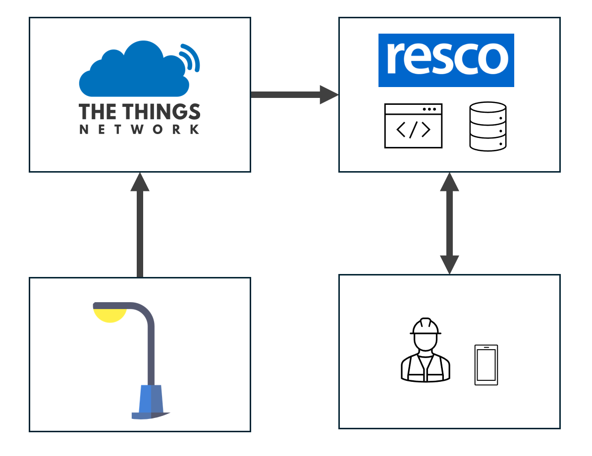
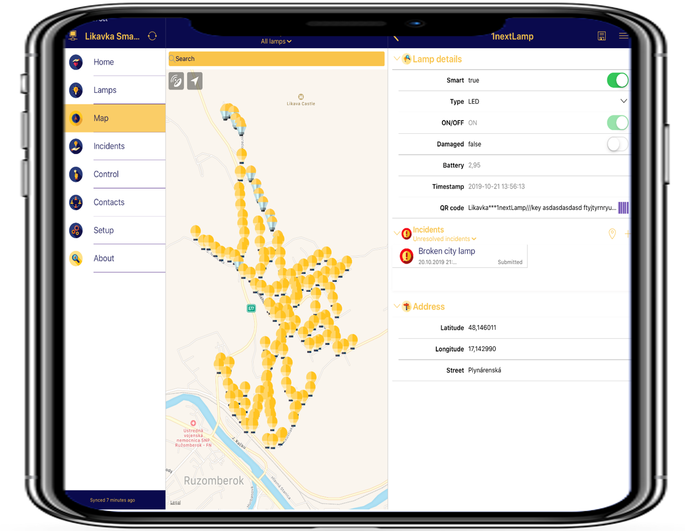

[Home](../README.md)
# IoT - Smart Lighting System (Likavka)

[Video](https://www.youtube.com/watch?v=a-1eh9SjFxM)

[Article](https://www.lepsiaobec.sk/viete-kto-je-vitazom-madhack-iot-pre-lepsiu-obec/
)

## Problem
There are a lot of city lamps wordlwide. Some of them are already smart enough, 
so they are able to switch on/off online or send notification about some deffects to technicians.
On the other hand, there are lamps (the cheaper ones), which dont offer such a features.
Create solution, that brings these features to the non-intelligent city lamps. 
From business perspective, system should be cost effective, comparing to buying the new smart lamps.

## Solution

* Current sensors with combination of IoT devices were installed to city lamps.
* IoT device reads value every hour from the sensor and sends data to the gateway (The Things Network).
* Plugin on the Resco server was executed every 30 minutes and reads new data from The Things Network Hub.
* Data were processed and saved to the database.
* Field Technician was able to sync the app with server and see state of the lamps. In addition, if plugin on the Resco Server detects wrong value of the lamp, it sends notification to Field Technician about it.

[->Next: Biomedical Engineering](../biomedicalEngineering/readme.md)
