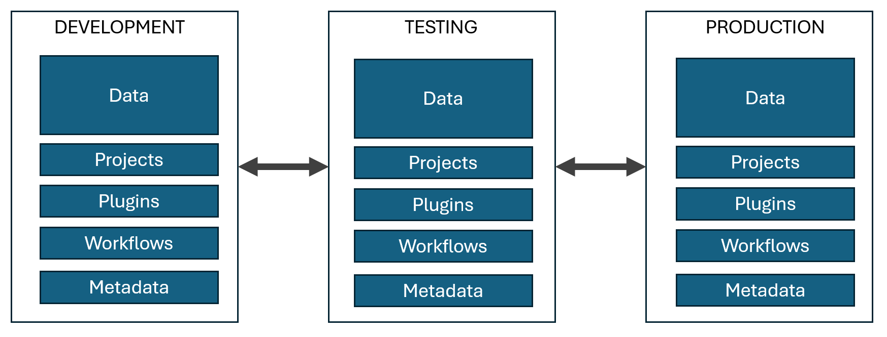

[Home](..\readme.md)
# Migration Tool For UAT Environments
## Problem

Resco Server offers possibility to migrate data and schema between UAT environments, 
but it would be beneficial to add ability to user migrate only smaller components and to make clone of the organization by a few clicks.
In addition, migration/cloning should be done as long running job, so user is able to continue in work without waiting on the page.

## Soulution

* Data are divided to smaller selectable components. 
* User is able to select which components should be migrated.
* User is able to clone the whole organization by a few clicks.
* Last, but not least migrate processing is implemented as long running job, which is executed every 5 minutes and data are migrated in smaller batches.

UI-Component selection:

UI-Metadata comparison-Import preview

[->Next: Integrations with 3rd party systems](../integrations/readme.md)